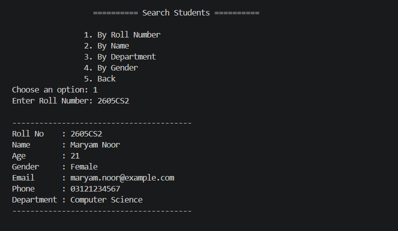
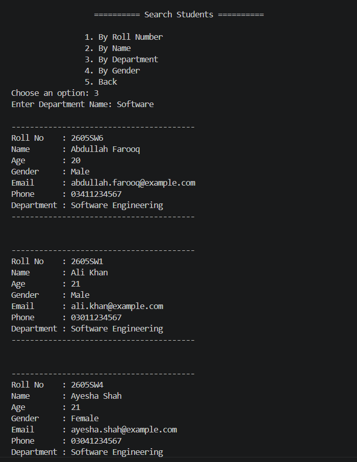
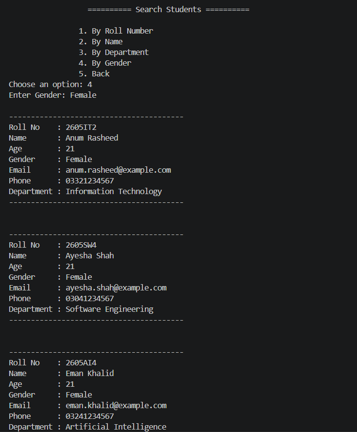
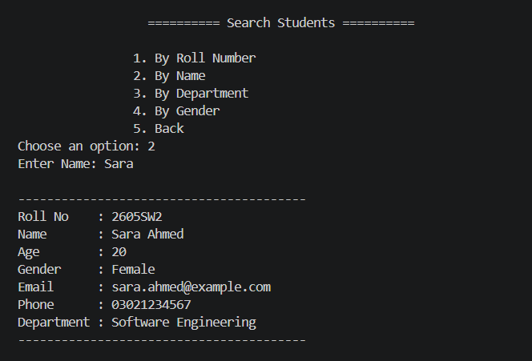

# 🎓 Student Management System

A console-based Student Management System built with **Python** and **SQLite** following a clean layered architecture using the **Repository Pattern** and **Service Layer**.

This project was built to practice real-world backend development concepts including database management, input validation, file handling, logging, testing, and software architecture.

---

## 🚀 Features

### 📚 Department Management
- Add new departments
- Prevent duplicate departments
- View all departments

### 👨‍🎓 Student Management
- Add students
- View students
- Update student information
- Delete students
- Search students by Roll Number
- Search students by Name
- Search students by Department
- Search students by Gender

### 📊 Student Statistics
- Total number of students
- Total departments
- Average age
- Youngest student age
- Oldest student age
- Students per department

### 🔍 Sorting
Sort students by:
- Name
- Roll Number
- Age
- Department

### 📄 Pagination
- View students page by page
- Previous / Next navigation

### 📁 CSV Support
- Export students to CSV
- Import students from CSV
- Validation during import
- Import summary (Imported / Skipped / Failed)

### 💾 Database Backup & Restore
- Backup SQLite database
- Restore database from backup

### ✅ Input Validation
Validation for:
- Roll Number
- Name
- Age
- Gender
- Email
- Phone Number

### 📝 Logging
Application logs important operations and errors using Python's logging module.

### 🧪 Unit Testing
Includes unit tests for:
- Validators
- Service layer

---

# 🛠 Technologies Used

- Python 3
- SQLite
- Object-Oriented Programming (OOP)
- Repository Pattern
- Service Layer
- CSV Module
- Logging Module
- unittest


# ⚙️ Installation

Clone the repository

```bash
git clone https://github.com/kq-050/student-management-system.git
```

Navigate to the project

```bash
cd student-management-system
```

Run the application

```bash
python main.py
```

---

# 🧪 Running Tests

Run all unit tests:

```bash
python -m unittest discover -s tests -v
```
This project uses only Python's standard library, so no additional packages need to be installed.

---
# 📂 Project Structure

```text
student-management-system/
│
├── database/
│   ├── __init__.py
│   ├── connection.py
│   ├── database_repository.py
│   ├── department_repository.py
│   └── student_repository.py
│
├── models/
│   ├── department.py
│   └── student.py
│
├── services/
│   ├── database_service.py
│   ├── department_service.py
│   └── student_service.py
│
├── utils/
│   └── display.py
│
├── tests/
│   ├── test_department_service.py
│   ├── test_student_service.py
│   └── test_validators.py
│
├── screenshots/
├── imports/
├── exports/
├── backups/
├── logs/
│
├── main.py
├── validators.py
├── logger.py
├── requirements.txt
├── README.md
└── student.db

```
# 📷 Screenshots

### Main Menu


---

### Add Student


---

### View Students


---

### Search Students
The application supports searching students using multiple criteria.









---

### Student Statistics
View overall statistics including total students, departments, and gender distribution.


---

### Sort Students


---

### Export & Import CSV


---

### Backup & Restore


---

# 💡 Concepts Practiced

- Object-Oriented Programming
- Repository Pattern
- Service Layer Architecture
- SQLite Database Operations
- SQL JOIN Queries
- CRUD Operations
- Input Validation
- File Handling
- CSV Import/Export
- Exception Handling
- Logging
- Unit Testing
- Pagination
- Sorting
- Search Functionality

---

# 🎯 Future Improvements

- GUI version using Tkinter or PyQt
- Authentication (Admin Login)
- Password hashing
- Student photo support
- PDF report generation
- Advanced filtering
- REST API using Flask/FastAPI
- MySQL/PostgreSQL support


## 👨‍💻 Author

Khadija Qasim

LinkedIn: https://www.linkedin.com/in/khadija-qasim-986789327/

GitHub: https://github.com/kq-050